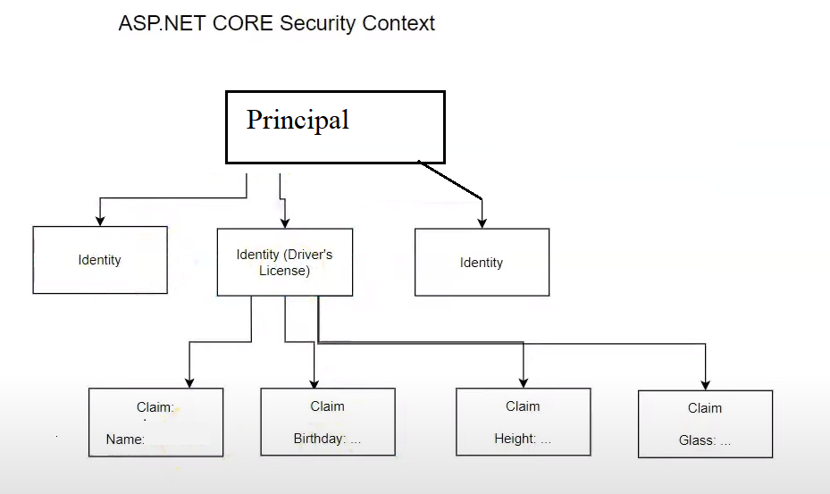

## ASP.NET Code Web Application using Razor
#### - Demonstrates basic security ideas from scratch
- Principal
- Identity
- Claims
- Security Context
- Cookie

## Authentication

- Verify that you are who you say you are
- Generate the Security Context
- Security Context
    - This contains info about you
    - In Cookie authentication, we generate a cookie
    - In Token authentication, we generate a token
- This is the process of logging in, providing the username and password
- So you have a cookie or a token that contains a security context
- When you go to various pages, you will carry the security context
- The web server
    - Verifies your credentials
    - Talks to a data store
    - Generates the security context
- Cookies arent shared to other domains
- Every call to the server will contain this cookie
- The server will desearialize and decrypt the cookie and authenticate the user
- Then we Authorize and see if the user has rights to the page or whatever

## Authorization

- Verifying that the Security Context(your indentity) satisfies the access requirements
- Each page can have different requirements so it will look at the security context to see if you have these requirements
- a 403 will be returned if you dont have the rights to a page
- a 401 will be returned if you are not even authenticated (logged in)

## ASP.NET Core Security Context

- Claims Principal Object or simply Principal
    - Contains Username, email, etc. of the logged-in-user
    - The Principal IS the user
- Principal contains one or more Identities
    - e.g. Student card, Drivers license, Apartment Access Card.
    - Usually we have one identity
- An Identity can contain one or more Claims
- Claims are key/value pairs. e.g. Age: 40
 
## Authorization Architecture and Flow

- Each page can have a different requirements
	- Anonymous
	- Admin
	- HR
	- Admin + HR
	- Age > 18
- Routing middleware will tell us what page the user wants
- Authentication middleware will identify the user and will have all his info and claims
- Authorization middleware will look at Claims from user to see if they have the rights to the page
- If not allow, a 403 (Challenge) will be returned

- Requirements can be grouped together to form a Policy
- Apply these policies by using the Authorize attribute

- For a custom sitionation such as (Age>18) we have to create a custom requirement.
- Each Requirement has to have a corresponding Authorization handeler
- Authorization middleware uses IAuthorizationService (just like the Authentication middleware uses IAuthenticationService)
- For the custom case, you need to create a class that derives from AuthorizationHandeler
- So, 
    - the Policy is applied to a certain page
    - which contains a custom requirement (Requirement1)
    - we have a Requirement1AuthorizationHandeler to check the requirement
    - the AuthorizationService will be invoked by the Authorization middleware
    - which completes the check, so now you are either granted access or denied

- [Authorize] - denies anonymous access
- Core knows that your login page is: \Account\Login

